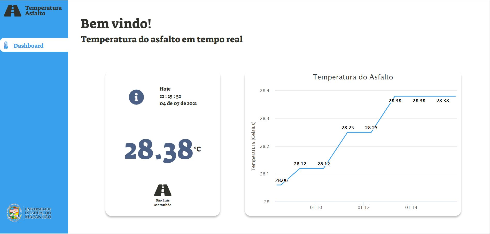

# Controle de Temperatura
 Dashboard de monitoramento da temperatura em tempo real, através do sensor de temperatura a prova d'agua (DS18B20). 
 Com esse sensor é possivel desenvolver diversas aplicações, entre elas, a medição de temperatura do asfalto, que está sendo desenvolvida atraves de rede de sensores.

 # O projeto v1.0
 Essa é a primeira versão do projeto, com um frontend simples, e backend por conta do ESP32, que é responável pelo servidor.

 

 - Temperatura: é lida e retornada em tempo atráves do sensor DS18B20 conectado ao ESP32.
 - Data e Hora: atráves de script javascript, foi pego a data e hora atual.
 - Localização: o lugar em que o sensor está situado, pois isso pode determinar outros fatores.
 - Gráfico: o grafico de temperaturas foi feito através da do conjunto de graficos da [HighCharts](https://www.highcharts.com/) e também é atualizado em tempo real.

